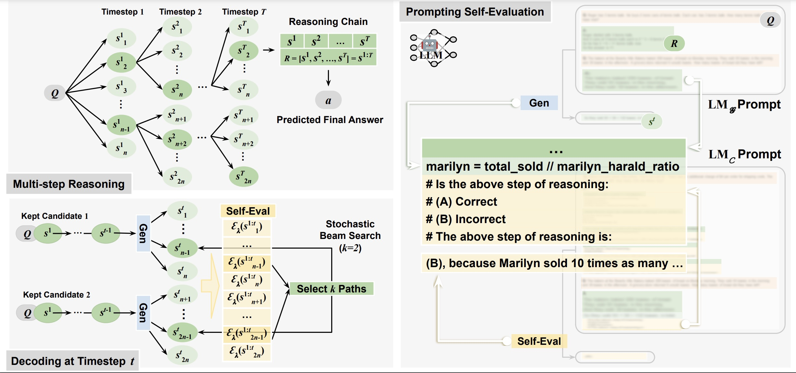

# SelfEval-Guided Decoding for Multi-step Reasoning

This repository contains code and models for the paper: [Decomposition Enhances Reasoning via Self-Evaluation Guided Decoding](). 
Below is the framework of our proposed method (on the left) together with a prompting example of self-evaluation (on the right).



## Requirements

#### Environment

```
openai                             0.27.1
matplotlib                         3.3.4
numpy                              1.20.1
ipdb                               0.13.9
tqdm                               4.64.1
```

#### Data Preprocessing

We provide example formats of the input dataset in the folder [`data`](data).
For other datasets, please check the details of [prompt construction](src/utils/prompt.py), where we show the specific attributes each data point should contain.

#### OpenAI Keys

In the current version of our main method (in [`generate_code.py`](src/generate_code.py)), we adopt [`Codex`](https://openai.com/blog/openai-codex) as our backend LLM.
However, OpenAI has discontinued public access to this model.
To address this, you can either 1) apply for the [research access](https://openai.com/form/researcher-access-program) to `Codex` (`code-davinci-002`) to run our approach, or 2) utilize an alternative backbone `text-davinci-003`.
We will later also release the results of running based on `text-davinci` models for reference.


## Running

We show examples of how to run our method on different datasets in [`scripts`](scripts), like [the script for gsm8k](scripts/run_generation_gsm8k.sh).


---
<sub><sup>This repository is adapted from the code of the works [PaL: Program-Aided Language Model](https://github.com/reasoning-machines/pal) and [Program of Thoughts Prompting: Disentangling Computation from Reasoning for Numerical Reasoning Tasks](https://github.com/wenhuchen/Program-of-Thoughts). </sup></sub>


